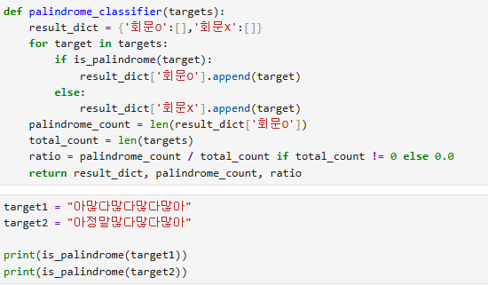
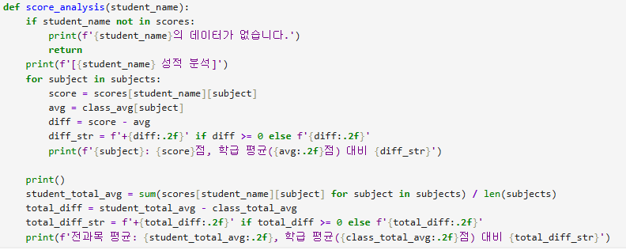

# AIFFEL Campus Online Code Peer Review Templete
- 코더 : 채진현
- 리뷰어 : 조연우


# PRT(Peer Review Template)
- [x]  **1. 주어진 문제를 해결하는 완성된 코드가 제출되었나요?**
    -문제를 잘 해결 했습니다.

.  

    
- [x]  **2. 전체 코드에서 가장 핵심적이거나 가장 복잡하고 이해하기 어려운 부분에 작성된 
주석 또는 doc string을 보고 해당 코드가 잘 이해되었나요?**
    - 해당 코드 블럭을 왜 핵심적이라고 생각하는지 확인
.

코드를 보고 문제의 이해력에 대해서 우수하다고 생각이 되는 코드를 짜준 부분인것 같음.  

    
- [ ]  **3. 에러가 난 부분을 디버깅하여 문제를 해결한 기록을 남겼거나
새로운 시도 또는 추가 실험을 수행해봤나요?**
    - 없음
- [ ]  **4. 회고를 잘 작성했나요?**
    - 회고없음.
        
- [x]  **5. 코드가 간결하고 효율적인가요?**
    - 문제에 맞게 코드를 잘 짰습니다. 


# 회고(참고 링크 및 코드 개선)
```
# 리뷰어의 회고를 작성합니다.
# 채진현님의 코드를 보고 같은 문제를 이런식으로도 풀 수있겠다라는 또 다른 관점을 얻어가는 시간이였습니다.
```
