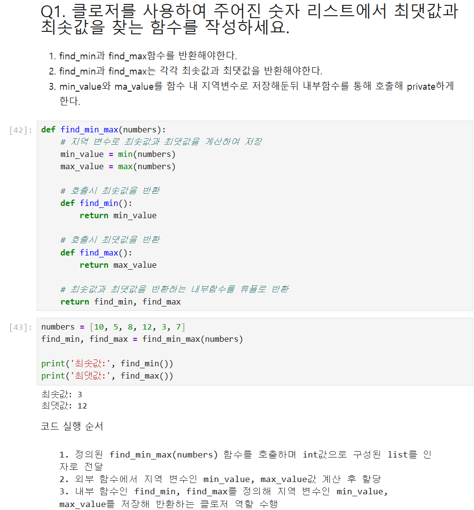
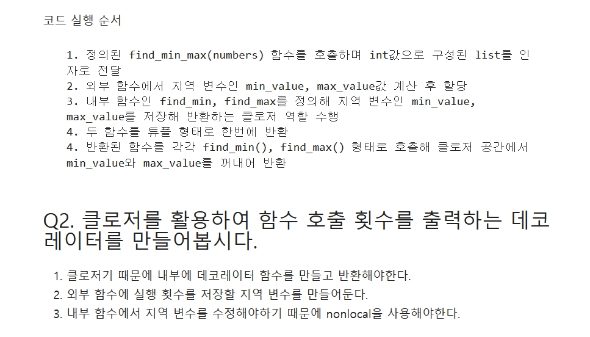
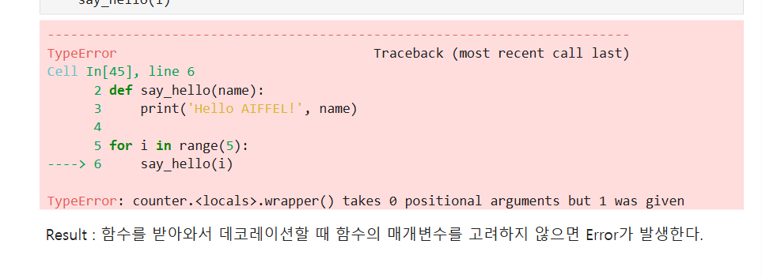

# AIFFEL Campus Online Code Peer Review Templete
- 코더 : 채진현  
- 리뷰어 : 임성배  


# PRT(Peer Review Template)
- [X]  **1. 주어진 문제를 해결하는 완성된 코드가 제출되었나요?**
    - 문제 해결을 위한 완성된 코드가 제출된 것을 확인하였습니다.
    - 첨부 이미지
        
    
- [X]  **2. 전체 코드에서 가장 핵심적이거나 가장 복잡하고 이해하기 어려운 부분에 작성된 
주석 또는 doc string을 보고 해당 코드가 잘 이해되었나요?**
    - 문제 해결을 위한 코드 실행 순서를 별도로 명시하여 어떤 방식으로 문제 풀이가 되는지 정리를 잘 하였습니다.  
    - 주석도 적절한 위치에 간결하고 명료하게 기재되어 있어서 인지하기 용이하였습니다.  
    - 첨부 이미지  
        
        
- [X]  **3. 에러가 난 부분을 디버깅하여 문제를 해결한 기록을 남겼거나
새로운 시도 또는 추가 실험을 수행해봤나요?**
    - 에러 발생 시 이에 대한 원인을 정리하고, 해결한 과정을 기록하여 진행 과정과 중요 포인트 등을 리마인드 할 수 있도록 잘 정리되어 있었습니다.  
     - 첨부 이미지
         
        
- [ ]  **4. 회고를 잘 작성했나요?**
    - 주어진 문제를 해결하는 완성된 코드 내지 프로젝트 결과물에 대해
    배운점과 아쉬운점, 느낀점 등이 기록되어 있는지 확인
    - 전체 코드 실행 플로우를 그래프로 그려서 이해를 돕고 있는지 확인
        - 중요! 잘 작성되었다고 생각되는 부분을 캡쳐해 근거로 첨부
        
- [ ]  **5. 코드가 간결하고 효율적인가요?**
    - 파이썬 스타일 가이드 (PEP8) 를 준수하였는지 확인
    - 코드 중복을 최소화하고 범용적으로 사용할 수 있도록 함수화/모듈화했는지 확인
        - 중요! 잘 작성되었다고 생각되는 부분을 캡쳐해 근거로 첨부


# 회고(참고 링크 및 코드 개선)
```
# 리뷰어의 회고를 작성합니다.
# 코드 리뷰 시 참고한 링크가 있다면 링크와 간략한 설명을 첨부합니다.
# 코드 리뷰를 통해 개선한 코드가 있다면 코드와 간략한 설명을 첨부합니다.
```
- 최소값과 최대값을 구하는 첫 번째 문제의 경우 클로저를 사용하면서도 간결하게 코딩을 한 부분이 좋은 인사이트가 되었습니다.  
- 코드의 실행 순서를 별도로 기재를 해 놓아서 좋은 참고가 될 거 같습니다.
- 문제 풀이 중 에러가 발생한 케이스에 대해서 원인을 찾고 해결한 과정을 포함 해 놓아서, 좋은 참고가 되었습니다.  

