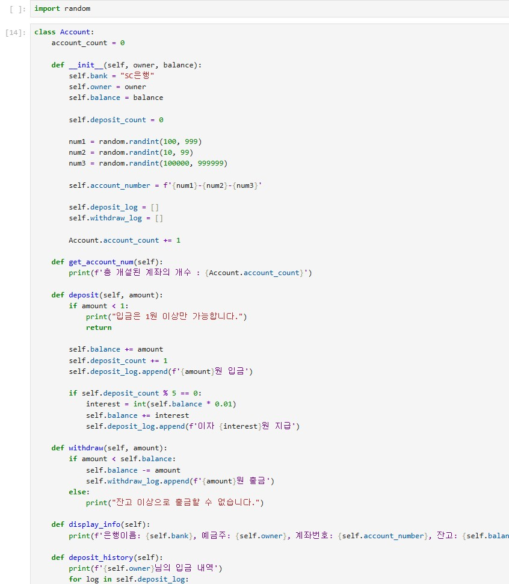
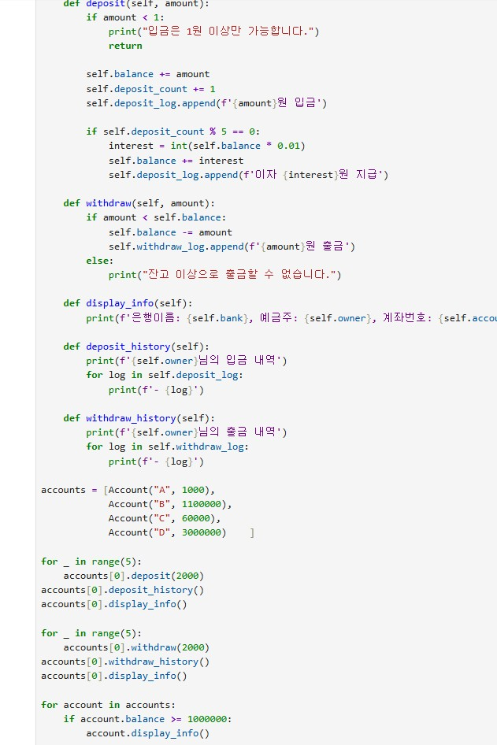

# AIFFEL Campus Online Code Peer Review Templete
- 코더 : 채진현
- 리뷰어 : 박애희


# PRT(Peer Review Template)
- [x]  **1. 주어진 문제를 해결하는 완성된 코드가 제출되었나요?**
    - 문제에서 요구하는 최종 결과물이 첨부되었는지 확인
        - 중요! 해당 조건을 만족하는 부분을 캡쳐해 근거로 첨부  



> 1번은 완료하셨고, 2번은 시간이 부족해서 원하시는 만큼 다 적지 못하신 상황 같다.

    
- [x]  **2. 전체 코드에서 가장 핵심적이거나 가장 복잡하고 이해하기 어려운 부분에 작성된 
주석 또는 doc string을 보고 해당 코드가 잘 이해되었나요?**
    - 해당 코드 블럭을 왜 핵심적이라고 생각하는지 확인
    - 해당 코드 블럭에 doc string/annotation이 달려 있는지 확인
    - 해당 코드의 기능, 존재 이유, 작동 원리 등을 기술했는지 확인
    - 주석을 보고 코드 이해가 잘 되었는지 확인
        - 중요! 잘 작성되었다고 생각되는 부분을 캡쳐해 근거로 첨부  
    


> 나는 실행 부분(객체 생성~출력)을 고민하다가 이것저것 다 출력해봤는데, 이 코드처럼 깔끔하게 필요 부분만 나눠서 출력해도 좋을 것 같다.

- [x]  **3. 에러가 난 부분을 디버깅하여 문제를 해결한 기록을 남겼거나
새로운 시도 또는 추가 실험을 수행해봤나요?**
    - 문제 원인 및 해결 과정을 잘 기록하였는지 확인
    - 프로젝트 평가 기준에 더해 추가적으로 수행한 나만의 시도, 
    실험이 기록되어 있는지 확인
        - 중요! 잘 작성되었다고 생각되는 부분을 캡쳐해 근거로 첨부  

> 시간이 더 충분했다면 저번처럼 남기셨을 것 같은데 이번에는 못하신 것 같다.


- [x]  **4. 회고를 잘 작성했나요?**
    - 주어진 문제를 해결하는 완성된 코드 내지 프로젝트 결과물에 대해
    배운점과 아쉬운점, 느낀점 등이 기록되어 있는지 확인
    - 전체 코드 실행 플로우를 그래프로 그려서 이해를 돕고 있는지 확인
        - 중요! 잘 작성되었다고 생각되는 부분을 캡쳐해 근거로 첨부  

> 시간이 부족하셔서 다 적지 못하신 것 같다. 

        
- [x]  **5. 코드가 간결하고 효율적인가요?**
    - 파이썬 스타일 가이드 (PEP8) 를 준수하였는지 확인
    - 코드 중복을 최소화하고 범용적으로 사용할 수 있도록 함수화/모듈화했는지 확인
        - 중요! 잘 작성되었다고 생각되는 부분을 캡쳐해 근거로 첨부  

> 저번에도 그렇고 코딩을 매우 간결하고 깔끔하게 작성하시는 것 같다. 


# 회고(참고 링크 및 코드 개선)
```
# 리뷰어의 회고를 작성합니다.
# 코드 리뷰 시 참고한 링크가 있다면 링크와 간략한 설명을 첨부합니다.
# 코드 리뷰를 통해 개선한 코드가 있다면 코드와 간략한 설명을 첨부합니다.
```
> 말씀을 들어보니 그루분께 설명까지 해주시다보니 그렇게 되신 것 같고, 나는 도저히 시간 안에 이 문제량을 다 소화하지 못할 것 같아서 그 자리에서 다 했다고는 볼 수 없는데, 다른 도움 없이 온전히 그 시간안에 이만큼 코딩하시면서 설명까지 하시다니 능력자이신 것 같다. 시간만 더 주어졌다면 충분히 다 해결하실 것 같다고 느꼈다. 그리고 볼 때마다 군더더기 없이 코딩하시는 느낌이 나는데, 나는 완성 시키기 전에는 좀 너저분하게 다 퍼뜨려 가면서 하다가 조립하듯 정리하면서 완성하는 편인데 이런 분들 보면 굉장히 감명깊다. 꼭 방청소 같다고 생각했는데 나는 일단 다 퍼뜨려서 다시 정리하는 편이라 순서가 뒤죽박죽 하다가 내 나름의 순서대로 조립하면서 마지막에 정리를 끝내는 편인데, 이런 분들은 방 청소도 뚝딱뚝딱 잘 하실 것 같다. 이럴 때마다 공부하고 익숙해져야 할 필요성을 느낀다. 